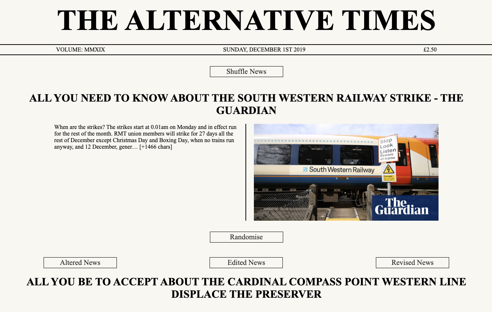

## Software Engineering Immersive at GA - Project 2 (Reactathon): The Alternative Times

### Goal: Working as a pair, to very quickly put together a React.js app that consumes at least one RESTful API

#### Timeframe: 2 days
---



### Technologies used
* React.js 
* JavaScript (ES6) / HTML5 / CSS3
* Axios & two RESTful APIs
* Git / Github

### Deployment
The app is deployed on Heroku and can be found here: [https://the-alternative-times.herokuapp.com/]()

### Overview
This project was a surprise Reactathon, in which we worked in pairs to build a React front-end that consumed at least one RESTful API. I was lucky to be paired with Mary-Anne, as we worked well together. 

We quickly decided on the idea - we would use the News API ([https://newsapi.org/]()) to retrieve a selection of headlines. The user would be able to choose a headline using a shuffle button, and then create an alternative news headline by clicking a button that would send in turn each word in the headline to the Words API ([https://www.wordsapi.com/]()) and receive back, for each word, an alternative word to replace the original and thus create an alternative headline.

### Approach

We started by making sure we had access to the two api's and could ask for and recieve the information we wanted from them. We acquired a key for the News API that we send them using the url. For the Words API we used Rapid API, attaching this in the headers of the request.

We then set up the app to work as follows:

1. Get the top headlines from the News API
2. The shuffle button randomly cycles through these
3. The randomise button sends the headline as an array of word strings to the Words API and receives back all the information available for each word
4. The three buttons with optons for different types of news each cause the algortihm to look for different types of information ('synonyms', 'typeOf', 'similarTo') in the data now held in state on each word from the headline and then use this to replace the original word with the relevant alternative before combining the words back into a single sentence again 


### Wins
* The use of a Promise.all when sending the words in a headline to the words API one by one. We had to learn how to do this to get the requests to work inside of a map
* The Promise.all:

```javascript
Promise.all(this.state.originalHeadline.map(word => {
  if (word.length < 8) {
    fakeHeadlineObject[word] = word
  } else {
    axios.get(`https://wordsapiv1.p.rapidapi.com/words/${word}`, {
   	   headers: { 
   	     'x-rapidapi-host': 'wordsapiv1.p.rapidapi.com',
   	     'x-rapidapi-key': wordsKey
  	 } })
   	 .then(res => fakeHeadlineObject[word] = res.data)
   	 .catch(() => fakeHeadlineObject[word] = word)
  } 
}))
  .then(() => this.setState({ fakeHeadlineObject }))
  .catch(err => console.log(err))
this.setState({ fakeHeadline: 'YOUR FAKE NEWS WILL APPEAR HERE' })
```

* The app works, and it tends to produce amusing results!
* Mary-Anne came up with nice styling to make the page look like a newspaper

### Challenges
* Dealing with gaps in information - the API doesn't hold all types of information on all words, so we had to include some control flow to deal with missing or undefined data
* The number of API requests we were sending - we introduced a minimum word length for words sent to the API to stop it trying to replace short words such as 'at' or 'and'
* Punctuation threw up some interesting errors, we ended up removing much of it with a Regex filter

### Future changes & features we would like to add
* Add the ability to chose the type of headline to change, such as 'sport' or 'entertainment'
* Change the image along with the headline